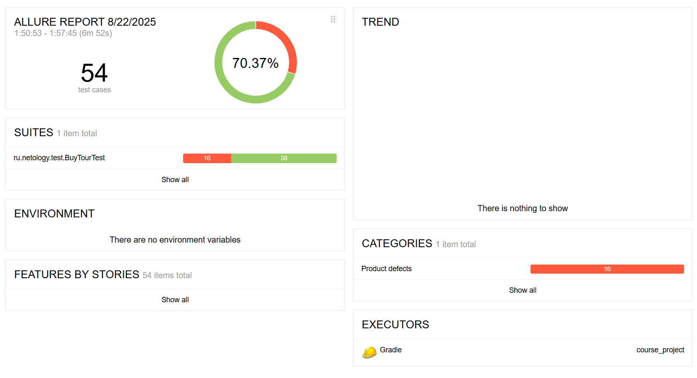

# Отчет о тестирование сервиса покупки тура

## Описание проекта

Проект представляет собой автоматизированное тестирование веб-приложения, позволяющего пользователям приобретать туры как стандартным образом, так и в кредит. Для тестирования использовалась инфраструктура Docker с базой данных PostgreSQL и Java-приложение, реализующее интерфейс взаимодействия с сайтом. Тестирование проводилось с использованием набора автотестов, охватывающих сценарии успешного бронирования тура, отказов транзакций и ввода некорректных данных.

---

## Настройка среды и инструкция по запуску

Для запуска тестов потребуется Docker-образ с PostgreSQL и подготовленный JAR-файл приложения. Далее необходимо настроить окружение и запустить тесты.

---

## Количество тест-кейсов

Общее число созданных и исполненных тест-кейсов составляет **54**.

---

## Процент успешных и неуспешных тест-кейсов

| Статус | Количество  |
|--------|-------------|
| Успех  | 38 (70.37%) |
| Неудача| 16 (29.63%) |

---

## Prerequisites

Для выполнения тестов необходима установка следующих компонентов:

- Docker Containers Desktop
- клиент Dbeaver для подключения к БД
- база данных PostgreSQL
- Java: AdoptOpenJDK 11
- IntelliJ IDEA 2025.1 (Community Edition) для сборки проекта Gradle
- веб-браузер Google Chrome  установленным драйвером Selenium WebDriver

---

## Установка и запуск

- git clone https://github.com/NataliaSerdakova/course_project
- склонированный файл открыть в Intellij Idea
- в терминале командой docker compose up запустить контейнер
- в Dbeaver создать новое соединение с базой данной PostgreSQL, данные для подключения находяться в файле docker-compose.yml
- в терминале командой java -jar ./artifacts/aqa-shop.jar запустить файл приложения
- в терминале командой ./gradlew clean test запустить тесты
- в терминале командой ./gradlew allureserve сгенерировать отчет о тестах

---

## Лицензия

Все материалы предоставлены исключительно для образовательных целей и защищены лицензией MIT License.
